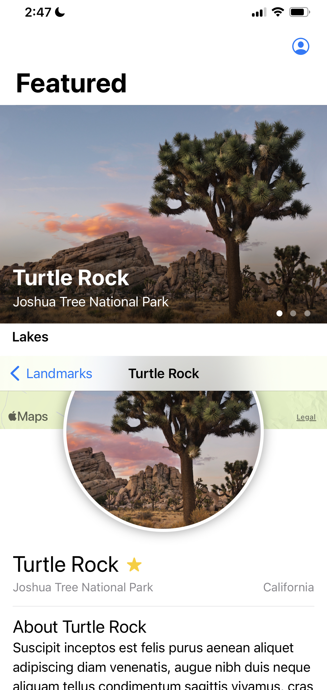

# SwiftUI Landmarks App



The SwiftUI Landmarks app is a sample iOS application built using SwiftUI framework to showcase some iconic landmarks. It allows users to explore various landmarks, view their details, and mark them as favorites.

## Features

- Browse a list of iconic landmarks.
- View detailed information about each landmark, including its location on the map.
- Mark landmarks as favorites and access them easily.
- Filter landmarks by category or location.
- Dark mode support for enhanced user experience.

## Requirements

- iOS 14.0+
- Xcode 12.0+
- Swift 5.3+

## Getting Started

1. Clone the repository:

   ```bash
   git clone https://github.com/your-username/swiftui-landmarks.git
   
2. Open the project in Xcode:

```bash
cd swiftui-landmarks
open Landmarks.xcodeproj
```
3. Build and run the app using the Xcode simulator.

## Project Structure

The project is organized into several directories, each serving a specific purpose:

- **Landmarks**: The main application target.
- **LandmarksUITests**: UI tests for the app.
- **LandmarksTests**: Unit tests for the app.
- **Resources**: Contains assets such as images and data files.
- **Models**: Data models used in the app.
- **Views**: SwiftUI views for different parts of the app.
- **Controllers**: View controllers for the map and other UI elements.
- **Helpers**: Utility classes and extensions.  

## Contributions
Contributions are welcome! If you find any issues or have suggestions for improvements, feel free to open an issue or create a pull request. Please follow the code of conduct when contributing.

## License
This project is licensed under the MIT License.

## Acknowledgments
This app is inspired by the SwiftUI tutorials and documentation provided by Apple.
Special thanks to the contributors and the open-source community for their valuable resources.
Contact
For any inquiries or questions, you can reach us at contact@example.com.

Happy coding!
